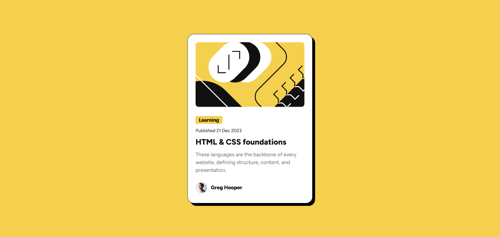

# Frontend Mentor - Blog preview card solution

This is a solution to the [Blog preview card challenge on Frontend Mentor](https://www.frontendmentor.io/challenges/blog-preview-card-ckPaj01IcS). Frontend Mentor challenges help you improve your coding skills by building realistic projects.

## Table of contents

- [Overview](#overview)
  - [The challenge](#the-challenge)
  - [Screenshot](#screenshot)
  - [Links](#links)
- [My process](#my-process)
  - [Built with](#built-with)
  - [What I learned](#what-i-learned)
  - [Author](#author)


## Overview

### Screenshot



### Links

- Solution URL: [https://github.com/troy71/blog-preview-card](https://github.com/troy71/blog-preview-card)
- Live Site URL: [https://troy71.github.io/blog-preview-card/](https://troy71.github.io/blog-preview-card/)

## My process

### Built with

- HTML5
- CSS custom properties
- Flexbox


### What I learned

I learnt how to change size of text for mobile devices without using media queries

```css
.learning {
  font-size: clamp(12px, 3vw, 14px);
}

```
## Author

- Frontend Mentor - [https://www.frontendmentor.io/profile/troy71](https://www.frontendmentor.io/profile/troy71)
